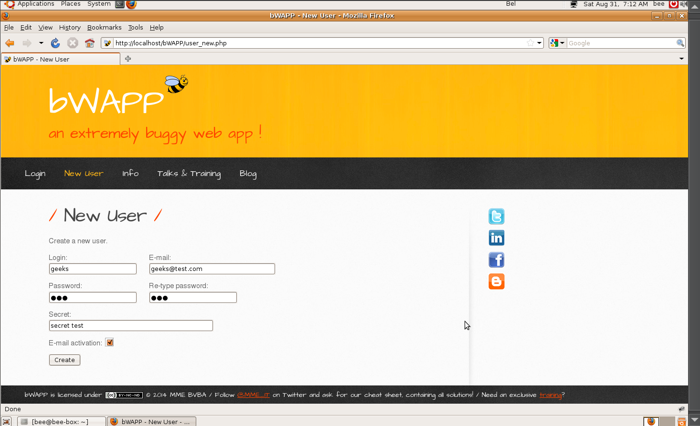
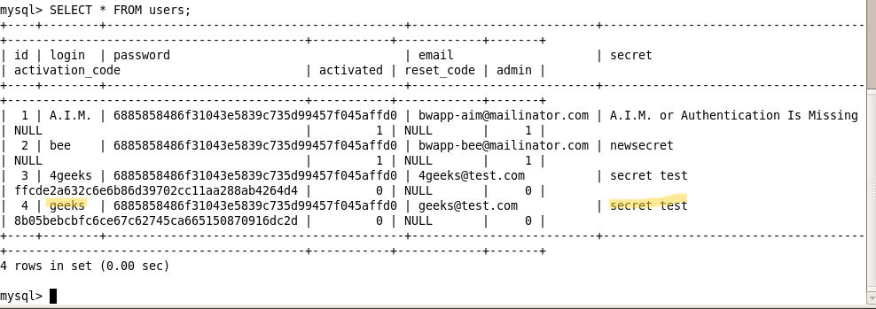

# `01` Configuracion inicial

### **Crear un nuevo usuario**

1. Inicia la máquina virtual beebox.
2. Accede a la interfaz web de bWAPP desde tu navegador usando la dirección IP de la máquina beebox.
3. **Crea un nuevo usuario**:
    - Crea un usuario llamado geeks con el secret: secret test.
    
4. Inicia sesión en bWAPP:

```bash
    - Usuario: bee
    - Contraseña: bug
```

### **Verificación en MySQL**

1. Abre la terminal en la VM Beebox.
2. Accede a MySQL usando el siguiente comando:

```bash
mysql -u root -p
```
> 💡 La contraseña predeterminada: `bug`

3. Selecciona la base de datos de bWAPP:

```sql
USE bWAPP;
```
4. Verifica que el usuario `geeks` y su "secret" hayan sido creados:

```sql
SELECT * FROM users;
```
   


