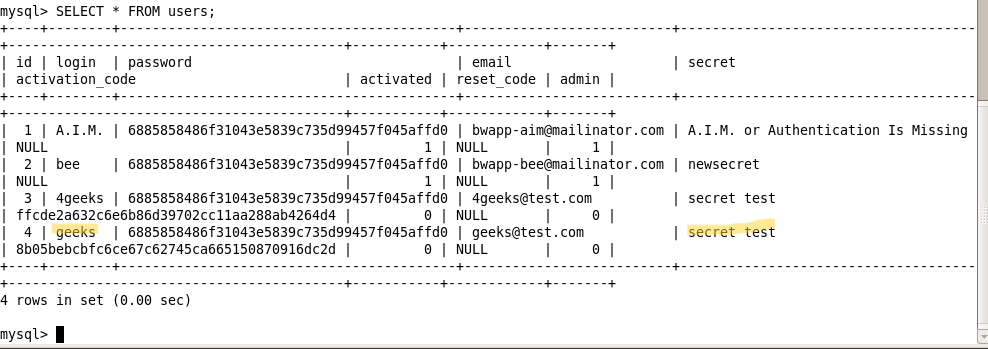

# `01` Initial Configuration

### **Create a New User**

1. Start the beebox virtual machine.
2. Access the bWAPP web interface from your browser using the IP address of the beebox machine.
3. **Create a new user**:
  - Create a user named geeks with the secret: secret test.  
  
4. Log in to bWAPP:

```bash
- Username: bee
- Password: bug
```

### **Verification in MySQL**

1. Open the terminal in the Beebox VM.
2. Access MySQL using the following command:

```bash
mysql -u root -p
```

> 💡 The default password: `bug`

3. Select the bWAPP database:

```sql
USE bWAPP;
```

4. Verify that the user `geeks` and their "secret" have been created:

```sql
SELECT * FROM users;
```
  

