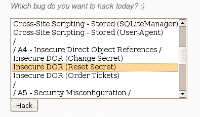

# `02` Modificación del secreto de otro usuario

1. Vuelve a iniciar sesión como el usuario predeterminado `bee`.
2. Selecciona la vulnerabilidad **Insecure DOR (Change Secret)** y "Hack".

3. Inspeccionar el Formulario HTML.

- Una vez en la página de cambio de "secret", haz clic derecho en el campo donde se ingresa el nuevo "secret" y selecciona "Inspeccionar" (o usa las herramientas de desarrollo del navegador).

4. Modificar el Valor del Formulario.

- En el código HTML inspeccionado, localiza el valor del campo oculto (input) que contiene el valor "bee".
- Cambia este valor por "geeks" para que, al enviar el formulario, se modifique el "secret" del usuario geeks en lugar del usuario bee.

5. Enviar el Formulario:

- Cambia el "secret" a hello geeks en el formulario, y envíalo.