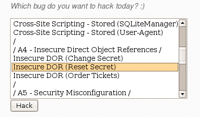
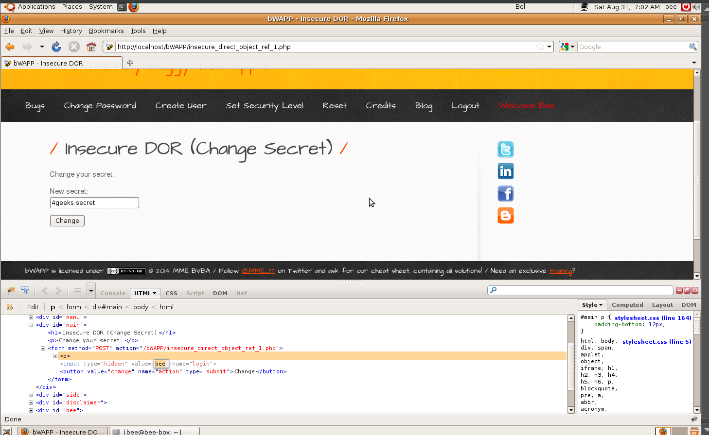
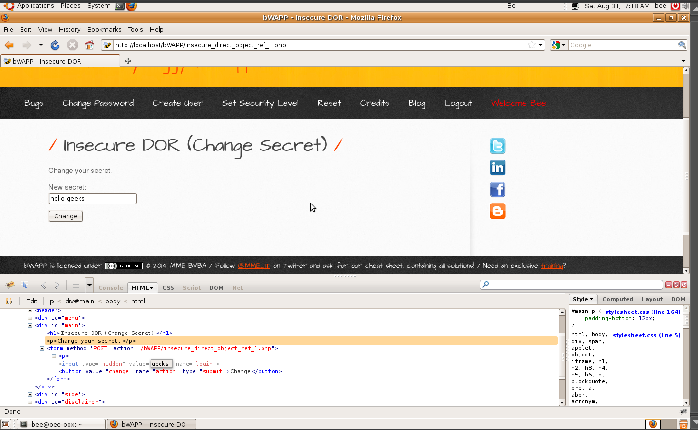

# `02` Modifying Another User's Secret

1. Log back in as the default user `bee`.
2. Select the **Insecure DOR (Change Secret)** vulnerability and click "Hack".

   

3. Inspect the HTML Form.

   - Once on the "secret" change page, right-click on the field where the new "secret" is entered and select "Inspect" (or use the browser's developer tools).

   

4. Modify the Form Value.

   - In the inspected HTML code, locate the value of the hidden input field containing the value "bee".
   - Change this value to "geeks" so that when the form is submitted, it modifies the "secret" of the user geeks instead of the user bee.

   

5. Submit the Form:

   - Change the "secret" to hello geeks in the form and submit it.