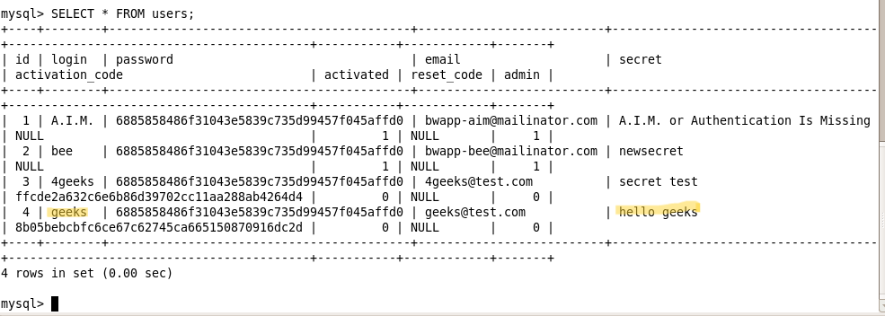

# `03` Verificación del cambio


### Comprobación en la Base de Datos:

1. Vuelve a la terminal de MySQL.
2. Verifica que el "secret" del usuario geeks haya sido modificado:

```bash
SELECT * FROM users;
```

> Deberías ver que el "secret" ha cambiado a hello geeks.




## ¿Te sientes confiado? 😎

### Explora Otras Vulnerabilidades de Broken Access Control en bWAPP:

Después de completar este ejercicio, te sugerimos que explores otras vulnerabilidades de Broken Access Control en bWAPP. Aquí tienes algunas opciones:

- Insecure DOR (Delete Secret)
- Insecure DOR (View Secret)
