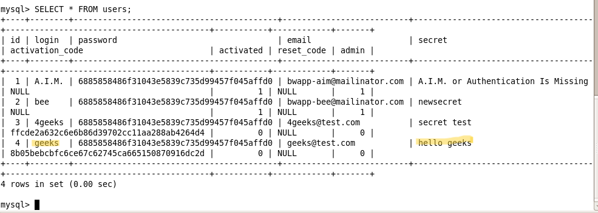

# `03` Verification of the Change

### Checking in the Database:

1. Return to the MySQL terminal.
2. Verify that the "secret" of the user geeks has been modified:

    ```bash
    SELECT * FROM users;
    ```

> You should see that the "secret" has changed to hello geeks.



## Feeling Confident? 😎

### Explore Other Broken Access Control Vulnerabilities in bWAPP:

After completing this exercise, we suggest exploring other Broken Access Control vulnerabilities in bWAPP. Here are some options:

- Insecure DOR (Delete Secret)
- Insecure DOR (View Secret)